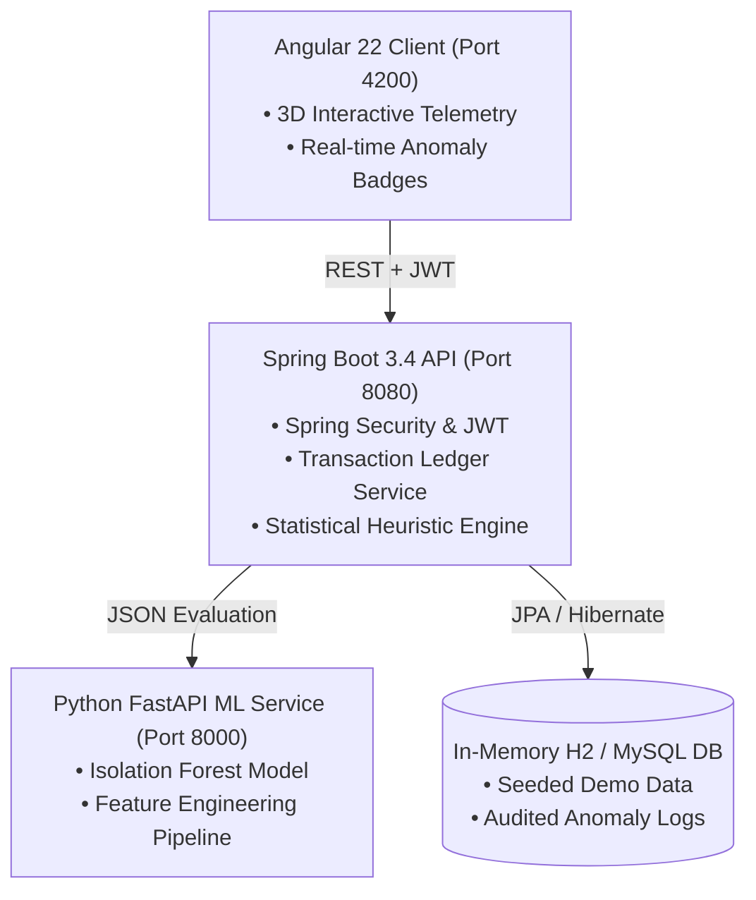

# 🚀 Personal Finance Anomaly Detector (IntelliSpend)

[](https://spring.io/projects/spring-boot)
[](https://angular.dev/)
[](https://python.org)
[](https://scikit-learn.org)
[](https://fastapi.tiangolo.com)
[](LICENSE)

> An enterprise-grade, intelligent financial intelligence platform featuring real-time transaction recording, automated spending analytics, dynamic budget controls, and an unsupervised Machine Learning engine that flags fraudulent outliers and behavioral spending spikes.

---

## 🌟 Key Features

* **🤖 Machine Learning Anomaly Detection**:
  * Powered by **Isolation Forest** unsupervised learning combined with temporal Z-score deviation models.
  * Detects price outliers, uncharacteristic transaction hours (circadian spikes), and velocity surges in sub-20ms.
  * Provides detailed forensic rationale for every flagged item (e.g., *“Price deviation > 12.3x category median at 03:14 AM”*).

* **🤝 Human-in-the-Loop Active Retraining**:
  * Users can validate anomalies directly from the UI (*"Confirm Anomaly"* vs. *"Mark Expected"*), feeding ground-truth feedback back into model weights.

* **💳 3D Interactive Holographic Telemetry**:
  * Modern, responsive interface built with Angular 22 standalone architecture.
  * Real-time spending charts, budget consumption meters, and interactive 3D perspective transforms.

* **🛡️ Production-Grade Security**:
  * Stateless **Spring Security 6** with **JWT (JSON Web Tokens)** authentication and BCrypt password encryption.
  * Role-based access control (RBAC) supporting `ROLE_USER` and `ROLE_ADMIN`.

* **📊 Dynamic Budgeting & Threshold Monitoring**:
  * Multi-category budget allocation with automated warning triggers when spending crosses 80% ceiling thresholds.

---

## 🏗️ System Architecture



---

## 💻 Tech Stack

| Component | Technologies Used |
| :--- | :--- |
| **Frontend** | Angular 22, TypeScript, Standalone Components, Custom Responsive CSS Design System |
| **Backend** | Java 21, Spring Boot 3.4, Spring Security, Spring Data JPA, Hibernate, JJWT |
| **Machine Learning** | Python 3.11+, Scikit-Learn (Isolation Forest), Pandas, NumPy, FastAPI, Uvicorn |
| **Database** | H2 (Zero-setup embedded mode) / MySQL 8.0+ |
| **API Documentation** | OpenAPI 3.0 / Swagger UI |

---

## ⚡ Quick Start (Run Locally)

### Prerequisites
* Java 21+ & Maven 3.9+
* Node.js v20+ & npm
* Python 3.10+ *(optional, embedded statistical engine activates automatically)*

### 1-Click Launch (Windows)
Double-click or run from PowerShell:
```powershell
.\start-intellispend.bat
```
*(Or in PowerShell: `.\start-intellispend.ps1`)*

---

### Manual Launch

#### 1. Backend (Spring Boot)
```bash
cd backend/expense-management-springboot
mvn spring-boot:run
```
*API available at: `http://localhost:8080`*  
*Swagger Documentation: `http://localhost:8080/swagger-ui.html`*

#### 2. Frontend (Angular)
```bash
cd frontend/expense-management-angular
npm install
npm start
```
*Web Application available at: `http://localhost:4200`*

---

## 🔑 Demo Account Credentials

The platform comes pre-seeded with realistic financial records and active ML anomalies:

* **Username**: `alex_morgan`
* **Password**: `Password123!`
* *(Or click **"Launch Showcase"** directly on the login screen for instant 1-click access)*

---

## 📡 Core API Endpoints

| Method | Endpoint | Description |
| :--- | :--- | :--- |
| `POST` | `/api/auth/login` | Authenticate user & issue JWT Bearer token |
| `POST` | `/api/auth/register` | Register new user profile |
| `GET` | `/api/expenses` | Retrieve all user transactions |
| `POST` | `/api/expenses` | Record new transaction (Triggers real-time ML anomaly detection) |
| `GET` | `/api/expenses/anomalies`| Filter flagged anomalies with risk scores |
| `GET` | `/api/analytics/dashboard`| Aggregate spending totals, category breakdowns & trend data |
| `GET` | `/api/budgets` | Fetch monthly category budget limits and progress |
| `POST` | `/api/anomalies/{id}/feedback` | Submit human verification feedback for model retraining |

---

## 🧪 Testing the ML Anomaly Detection

1. Log into **`http://localhost:4200`**.
2. Click **"+ Record Transaction"**.
3. **Normal Test**: Enter `$15.00` for `Food & Dining` ➔ Output: `✓ NORMAL`.
4. **Anomaly Test**: Enter `$4,250.00` for `Shopping & Luxury` ➔ Output: `⚠ CRITICAL (Risk Score: >0.90)` with Isolation Forest forensic explanation and dashboard alert.

---

## 📄 License
This project is open-source and available under the [MIT License](LICENSE).
